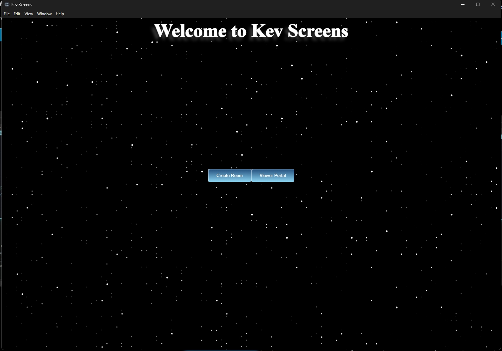
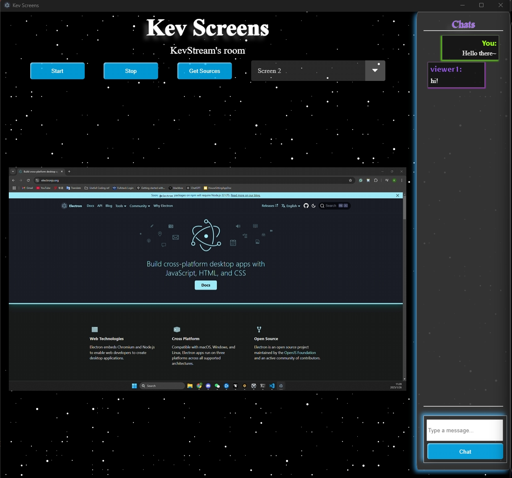
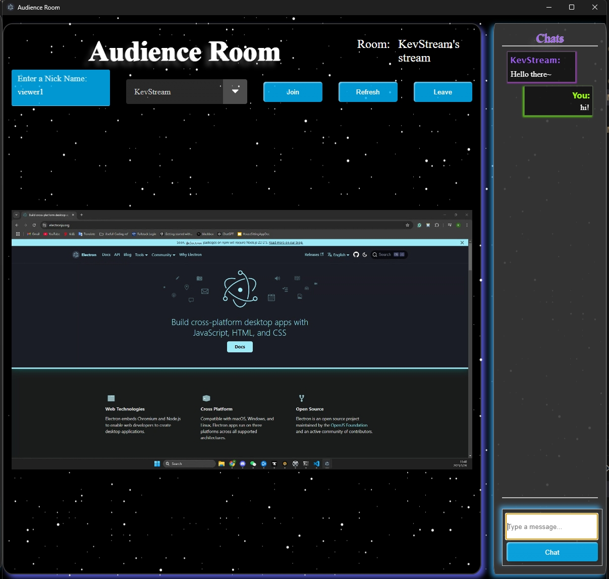

# KevScreens

KevScreens is a desktop application built with Electron.js that allows users to share their selected screens with others. This application leverages WebRTC technology for peer-to-peer connections, enabling seamless screen sharing experiences. Real-time data transfer is facilitated through WebSocket technology to exchange user data and establish ICECandidate peer connections.

Features

Screen Sharing: Easily share selected screens with others.

Real-Time Communication: Utilizes WebRTC for low-latency peer-to-peer communication.

WebSocket Integration: Facilitates real-time data exchange and connection establishment.

User Roles:

Streamer: Shares their screen with others.

Audience: Views the shared screen.

Tech Stack

Electron.js: For building the cross-platform desktop application.

Vanilla JavaScript: Core application logic.

Socket.io: Real-time, bi-directional communication between clients and server.

Express.js: Lightweight web server for handling WebSocket connections and user management.

Screenshots

Home Screen

Streamer Window

Audience Window

How It Works

Streamer Setup:

The streamer selects a screen or window to share.

A WebRTC peer connection is established with the audience.

The stream is broadcasted to connected audience members.

Audience Interaction:

Audience members connect via a unique session or code.

They receive the screen stream in real time.

WebSocket Communication:

WebSocket handles the signaling process, exchanging user details and ICECandidates to create the peer connection.

Installation

Clone the repository:

git clone https://github.com/yourusername/KevScreens.git

Navigate to the project directory:

cd KevScreens

Install dependencies:

npm install

Start the application:

npm start

Future Improvements

Add support for multiple simultaneous streamers and audience members.

Implement user authentication and session management.

Enhance UI/UX for a more intuitive experience.

Introduce support for recording shared screens.

Optimize WebRTC configurations for better performance on low-bandwidth connections.

Contributing

Contributions are welcome! Please feel free to submit a pull request or open an issue to suggest improvements or report bugs.

License

This project is licensed under the MIT License.